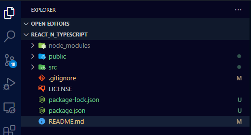
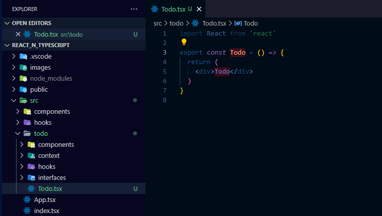

# react and typescript
## _Course Based on Youtube video with Fernando Herrera_
 [](https://www.youtube.com/watch?v=dNxaP_BTtwQ)

## 0.a. Initial Steps to start the project:
1. Use or create a directory for react tutorials (the mine is in the unit "E:")
```sh
e:
cd \
md tutorials
cd tutorials
md react
cd react
```
>This is my path: "E:\tutorials\react".

2. Check for the version installed of nodejs
```sh
node --version
```
>It must be "v14.x.x" or up (the mine is in v16.15.1).

3. Run the command to create the project 
```sh
npx create-react-app react_n_typescript --template typescript
```
4. Move to the new directory
```sh
cd react_n_typescript
```
5. Start the Visual Studio Code
```sh
code .
```
6. Check for the new structure created:


>Open each file into "src" directory.

7. Open a new terminal into Visual Studio Code, and run the command to start the app:
```sh
npm start
```

## 0.b. First Changes to the App
1. Delete the "App.css" file.
2. Delete the "App.test.tsx" file.
3. Open the "App.tsx" file.
4. Delete those three lines:
- import React from 'react';
- import logo from './logo.svg';
- import './App.css';
5. Delete all "header" Element (lines 5 to 18 aprox.)
6. Delete the className.
7. Transform the "div" just in a fragment
>This si the final result into "App.tsx" file:
```javascript
function App() {
  return (
    <>
      <h1>Hola Mundo</h1>
    </>
  );
}

export default App;
```
8. Delete the "index.css" file.
9. Open the "index.tsx" file.
10. Delete some elements to let "index.tsx" like this:
```javascript
import React from 'react';
import ReactDOM from 'react-dom/client';
import App from './App';

const root = ReactDOM.createRoot(
  document.getElementById('root') as HTMLElement
);
root.render(
  <React.StrictMode>
    <App />
  </React.StrictMode>
);
```
11. Delete the "logo.svg" file. 
12. Delete the "repostWebVitals.ts" file
13. Go to the https://getbootstrap.com/ page
14. Go the element "Include via CND" and copy the link
```javascript
<link href="https://cdn.jsdelivr.net/npm/bootstrap@...">
```
15. Open in "Public" directory the "index.html" file.
16. And paste below of this line:
```javascript
<title>React App</title>
```
>Almost line 28
17. Add in the "body" of "index.html" a class:
```html
<body class ="container bg-dark text-white">
```

## 1. useState

[React + TypeScript: useState](https://www.youtube.com/watch?v=m38MANQfjvo)
1. Create into "src" directory another called "components" directory.
2. Create a file called "Counter.tsx" file.
3. Write "_rafc_" and it will complete the bacic element of this component file.
4. Always delete the first line:
```javascript
import React from 'react'
```
>It is not ncessary, because the last Reac version.
5. Add the "Counter" into the "App.tsx" file.
6. add in "Counter.tsx" this line:
```javascript
const [counter, setcounter] = useState(0);
```
7. the "Counter.tsx" file fill have an "State" value (number) and three buttons to add 1, add 2 and back to 0.
8. Create another component called "Users.tsx".
9. Remember "_rafc_" snipet and delete the first line.
10. Add in "App.tsx" the "Users" component
11. Play with and object for the user.
12. Add an _Interface_ to define the structure of the Object.

## 2. useEffect + useRef + Custom Props
[React + TypeScript: useEffect + useRef + Custom Props](https://www.youtube.com/watch?v=gEFnZAj1qEE)

1. Some stetical adjust to "Counter" and "User" components.
2. Add a Component called "TimerMaster", remember "_rafc_" snipet and delete the first line.
3. Add component "Timer.tsx" to feed the "TimerMaster".
4. this is the basic component "Timer":
```javascript
  const [segundos, setSegundos] = useState(0);

  useEffect(() => {
    setInterval(()=> setSegundos(s => s+1), 1000);
  }, [])
  
  return (
    <>
    <h4>Timer: <small>{segundos}</small></h4>
    </>
  ```
5. Into "TimeMaster" set the millisec in 1000 or 2000, to send to "Timer".
6. "Timer" will recive this value in an Argument previous defined.
```javascript
type TimerArgs = { milliseconds: number};
```
7. Set the interval to put into a ref
```javascript
ref.current=setInterval(()=> setSegundos(s => s+1), milliseconds);
```
8. The ref is defined based on "setInterval type
```javascript
 const ref = useRef<NodeJS.Timeout>();
```
9. It is how to pass a reference data from a Father or Master to the son.

## 3. useReducer
[React + TypeScript: useReducer](https://www.youtube.com/watch?v=jJJNocMtGCg)

1. Create a new component called "CounterRed" as _reducer_, remember "_rafc_" snipet and delete the first line.
2. Add to "App.tsx".
3. Changes in "CounterRed": 
- Definition of _ActionType_ : Separted by a pipe (```|```).
- Add a Switch into "ContadorReducer" with the option defined in _ActionType_.
- Activate the "useReducer".

## 4. customHooks
[React + TypeScripts: customHooks](https://www.youtube.com/watch?v=HrV0HeGnzIw)

1. Change the Order in the "App.tsx" file.
2. Create a "Form.tsx" file, "_rafc_" snipet and delete the first line.
3. Add the "Form" to "App.tsx" file
4. Change in "Form.tsx", the ```<div>``` by the ```<form>```.
5. Complete the Form with data to ask to user as: Email and Name.
6. Those elements has an _onChange_ point to a funtion called "handleChange".
7. The initial type is _any_ but it is better to use _ChangeEvent_ type.
8. Adding the complete type to _ChangeEven_ it is ```<HTMLInputElement>```.
9. Change the simple _ev_ (Event) to the main element _targe_.
10. Improvement into "handreChange_ to define in a const: ```const {name, value} = target;```.
11. Create a "hooks" directory.
12. Create a file "useForm.tsx". The Hoolks always start with "use" word.
13. Write "_rafc_" snipent and delete the first line and the elements inside the function.
14. Create an exported function, and copy the form 4 to 14 lines.
15. In Form get the posible fields as argument:
 ```export const useForm = ( initState: any ) => {```.
 16. Toggle in Comment all copied as 4 to 14 lines.
 17. Call the "useForm" with initial values and getting the form and handleChange:
 ```javascript
 const {form,handleChange}= useForm({
    email:'',
    nombre:''
  });
 ```
 18. Into the "Form" add an _interface_ to avoid the _any_, and use the correct data structure.
 19. Into the "useForm" change the _any_ by "T" , adding some elements to do an _extends_: function
 ```javascript
export const useForm = <T extends Object>(initState: T ) => {
  const [form, setForm] = useState(initState);
 ```
 20. Into "Form" and "Form2" call the same structure.
 21. Return form "useForm" all include the "form" as unstructured way: ```return { form, handleChange, ...form };```
 22. I can get the values in the return: ```const { form, handleChange, email, nombre, edad } = useForm<FormData>```
 23. And use without this line : ```// const {email, nombre, edad}=form;```

## 5. useContext , createContext, ContextProvider
[React + TypeScript: useContext , createContext, ContextProvider](https://www.youtube.com/watch?v=8HE657KssxE)
1. The sugestion for this new task is create another projerc, but I'll just add to the "App.tsx" file.
2. Add a new module or directory into "scr" called "todo".
3. Add thos directories into "todo":
- "components"
- "context"
- "hooks"
- "interfaces"
4. Add a file called "Todo.tsx" into "todo" directory, remember "_rafc_" snipet and delete the first line. This is how it looks like:
.
 5. Add in "todo.tsx" file some elements as: ```<ul> <li><li/> <ul> ```
 6. Let's go to prepare the _context_ into "context" directory add a file called "TodoContext.ts".
 7. Just add a _createContext_ and it will add the react importation: ```import { createContext } from "react";```
 8. Add the basic line to export the _context_: ```export const TodoContext = createContext({});```
 9. Create in "context" a file called "TodoProvider.tsx", write "_rafc_" and delete the first line.
 10. Change the ```<div>``` by ```<TodoContext.Provider>```, and import the ```{TodoContext}```.
 10. Inside the ```<TodoContext.Provider>``` add the ```{children}```
 >>A higher-order component (HOC) is an advanced technique in React for reusing component logic. HOCs are not part of the React API, per se. They are a pattern that emerges from React's compositional nature. Concretely, a higher-order component is a function that takes a component and returns a new component.
 11. Delete the first line ```import { Children } from 'react';``` and the word _childre_ is in lowercaps.
 12. In the line with ```imporrt``` pot into pharentesis this value ```{children}:any```. The ```children``` is a _props_ .
 13. add in TodoContextProvider this "value={{}}", is is the expected result: ```<TodoContext.Provider value={{}}>```.
14. Add an _interface_ called "props", as an object with those values:
```javascript
interface props{
  children: JSX.Element | JSX.Element[]
}
```
15. Change the "any" in the ```export``` line by "props" , the new interface.
16.3 Add the "TodoProvider" in the "Todo.tsx" it is the roor, and I'll need all the info from there: ```<TodoProvider>```
16. Remember to import into "Todo.tsx" the "TodoProvider": ```import { TodoProvider } from './context/TodoProvider';```

## License

MIT
