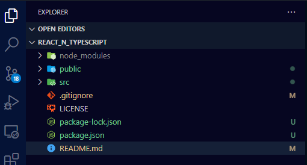

# react and typescript
## _Course Based on Youtube video with Fernando Herrera_
 [](https://www.youtube.com/watch?v=dNxaP_BTtwQ)

## Initial Steps to start the project:
1. Use or create a directory for react tutorials (the mine is in the unit "E:")
```sh
e:
cd \
md tutorials
cd tutorials
md react
cd react
```
>This is my path: "E:\tutorials\react".

2. Check for the version installed of nodejs
```sh
node --version
```
>It must be "v14.x.x" or up (the mine is in v16.15.1).

3. Run the command to create the project 
```sh
npx create-react-app react_n_typescript -template typescript
```
4. Move to the new directory
```sh
cd react_n_typescript
```
5. Start the Visual Studio Code
```sh
code .
```
6. Check for the new structure created:


>Open each file into "src" directory.

7. Open a new terminal into Visual Studio Code, and run the command to start the app:
```sh
npm start
```
## First element in the project
1. 

## License

MIT
